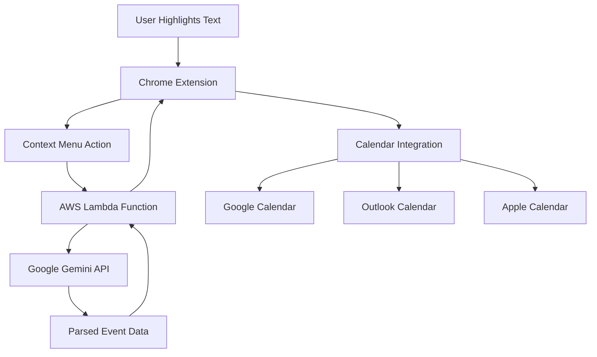

# 📅 QuickCal - AI-Powered Calendar Assistant

<div align="center">


**Transform any text into calendar events instantly with AI**

[](https://chrome.google.com/webstore)
[](https://developer.mozilla.org/en-US/docs/Web/JavaScript)
[](https://aws.amazon.com/lambda/)
[](https://ai.google.dev/)

*Highlight any event description on the web → Right-click → Instant calendar event*

[🚀 **Demo**](#-demo) • [✨ **Features**](#-features) • [🛠️ **Installation**](#%EF%B8%8F-installation) • [🏗️ **Architecture**](#%EF%B8%8F-architecture)

</div>

---

## 🎯 Overview

QuickCal is an intelligent Chrome extension that leverages **Google's Gemini AI** to automatically parse natural language event descriptions and create calendar events across multiple platforms. Built with modern web technologies and deployed on **AWS Lambda** for scalable, serverless processing.

### 🚀 Key Highlights
- **AI-Powered**: Uses Google Gemini for intelligent text parsing
- **Multi-Platform**: Supports Google Calendar, Outlook, Apple Calendar, and more
- **Serverless Architecture**: AWS Lambda backend for scalability
- **Zero Setup**: No API keys required for users
- **Privacy-First**: Processes text securely without storing user data

---

## ✨ Features

### 🤖 **Intelligent Event Parsing**
- Extracts event details from natural language text
- Automatically determines dates, times, locations, and descriptions
- Handles various date/time formats and relative dates ("tomorrow", "next week")
- Smart fallbacks for missing information

### 📱 **Multi-Calendar Support**
- **Google Calendar** - Direct web integration
- **Microsoft Outlook** - Deep link support
- **Apple Calendar** - ICS file generation
- **Other Calendars** - Universal ICS format

### 🎨 **User Experience**
- **One-Click Operation**: Right-click context menu integration
- **Visual Feedback**: Chrome notifications for processing status
- **Error Handling**: Graceful fallbacks and user-friendly error messages
- **Customizable**: Calendar preference settings

### 🏗️ **Technical Features**
- **Serverless Backend**: AWS Lambda for cost-effective scaling
- **CORS Compliant**: Secure cross-origin requests
- **Manifest V3**: Latest Chrome extension standards
- **Error Recovery**: Comprehensive error handling and logging

---

## 🎬 Demo

### How It Works
1. **Highlight** any text containing event information on any webpage
2. **Right-click** and select "Add selection to calendar"
3. **Watch** as QuickCal processes the text with AI
4. **Click** to add the parsed event to your preferred calendar

### Example Inputs
```text
"Team meeting tomorrow at 2 PM in Conference Room A"
→ Creates event for next day, 2:00-3:00 PM, location set

"Lunch with Sarah next Friday at 12:30 at The Italian Place"
→ Parses date, time, attendee, and location automatically

"Project deadline March 15th"
→ Creates all-day event with proper date handling
```

---

## 🛠️ Installation

### For Users

#### Option 1: Chrome Web Store (Coming Soon)
1. Visit the Chrome Web Store
2. Search for "QuickCal"
3. Click "Add to Chrome"

#### Option 2: Developer Installation
1. Download the latest release from [Releases](../../releases)
2. Extract the ZIP file
3. Open Chrome and navigate to `chrome://extensions/`
4. Enable "Developer mode" (top right)
5. Click "Load unpacked" and select the extracted folder

### For Developers

#### Prerequisites
- Node.js 18+ or Python 3.9+
- AWS Account (for Lambda deployment)
- Google AI Studio Account (for Gemini API)

#### Setup
```bash
# Clone the repository
git clone https://github.com/chinmaygovind/QuickCal.git
cd QuickCal

# Test the extension locally
# Load the extension in Chrome developer mode

# Deploy AWS Lambda (optional - for custom deployment)
# See lambda/AWS_DEPLOYMENT.md for detailed instructions
```

---

## 🏗️ Architecture

### System Design


### Technology Stack

#### Frontend (Chrome Extension)
- **JavaScript ES6+**: Modern syntax and features
- **Chrome Extension API**: Manifest V3 compliance
- **HTML/CSS**: Clean, responsive UI
- **Chrome Storage API**: User preferences persistence

#### Backend (AWS Lambda)
- **AWS Lambda**: Serverless compute
- **API Gateway**: RESTful API endpoints
- **CloudWatch**: Logging and monitoring
- **Environment Variables**: Secure configuration

#### AI Integration
- **Google Gemini API**: Natural language processing
- **Custom Prompts**: Optimized for event parsing
- **JSON Response Parsing**: Structured data extraction

### Security & Privacy
- **No Data Storage**: Events processed in real-time only
- **Secure API Calls**: HTTPS-only communication
- **Environment Variables**: API keys stored securely
- **CORS Protection**: Proper cross-origin handling

---

## 📂 Project Structure

```
QuickCal/
├── 📁 images/              # Extension icons and assets
├── 📁 quickcal/            # Extension UI and logic
│   ├── popup.html          # Extension popup interface
│   ├── init.js             # Popup initialization
│   ├── styles.css          # UI styling
│   └── 📁 setup/           # User setup guides
├── 📁 lambda/              # AWS Lambda functions
│   ├── lambda-function.js  # Node.js implementation
│   ├── lambda-function.py  # Python implementation
│   └── AWS_DEPLOYMENT.md   # Deployment guide
├── manifest.json           # Extension manifest (V3)
├── quickcal.js            # Background service worker
├── package_extension.bat   # Automated packaging
└── README.md              # This file
```

---

## 🔧 Development

### Building the Extension
```bash
# Package for distribution
./package_extension.bat

# Advanced packaging with options
./package_extension_advanced.bat
```

### Testing
```bash
# Test Lambda endpoint
cd lambda
python simple_test.py

# Comprehensive testing
python test_lambda.py
```

### Deployment
1. **Lambda Function**: Deploy using AWS Console, CLI, or Serverless Framework
2. **Extension**: Package and distribute via Chrome Web Store or manual installation

---

## 🤝 Contributing

Contributions are welcome! Please feel free to submit a Pull Request. For major changes, please open an issue first to discuss what you would like to change.

### Development Setup
1. Fork the repository
2. Create a feature branch (`git checkout -b feature/AmazingFeature`)
3. Commit your changes (`git commit -m 'Add some AmazingFeature'`)
4. Push to the branch (`git push origin feature/AmazingFeature`)
5. Open a Pull Request

---

## 📄 License

This project is licensed under the MIT License - see the [LICENSE](LICENSE) file for details.

---

## 👨‍💻 Author

**Chinmay Govind**
- GitHub: [@chinmaygovind](https://github.com/chinmaygovind)
- LinkedIn: [Connect with me](https://linkedin.com/in/chinmaygovind)

---

## 🙏 Acknowledgments

- **Google Gemini AI** for powerful natural language processing
- **AWS Lambda** for reliable serverless infrastructure
- **Chrome Extensions API** for seamless browser integration
- **Open Source Community** for inspiration and resources

---

<div align="center">

**⭐ Star this repository if you found it helpful!**

Made with ❤️ by [Chinmay Govind](https://github.com/chinmaygovind)

</div>
